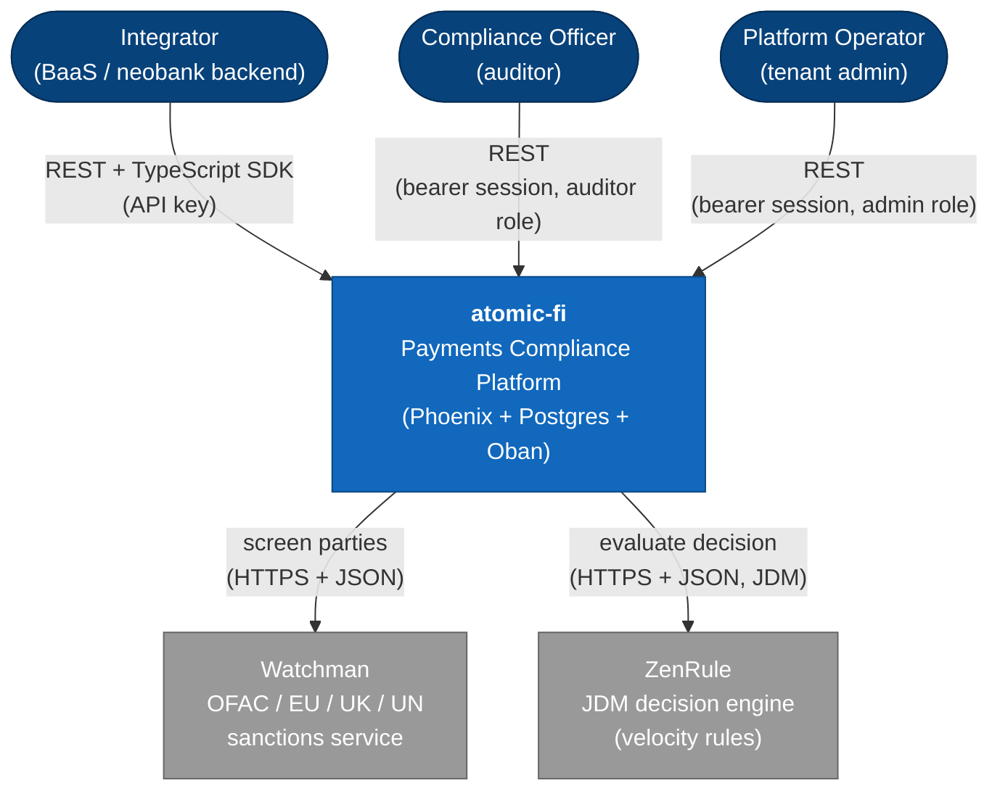
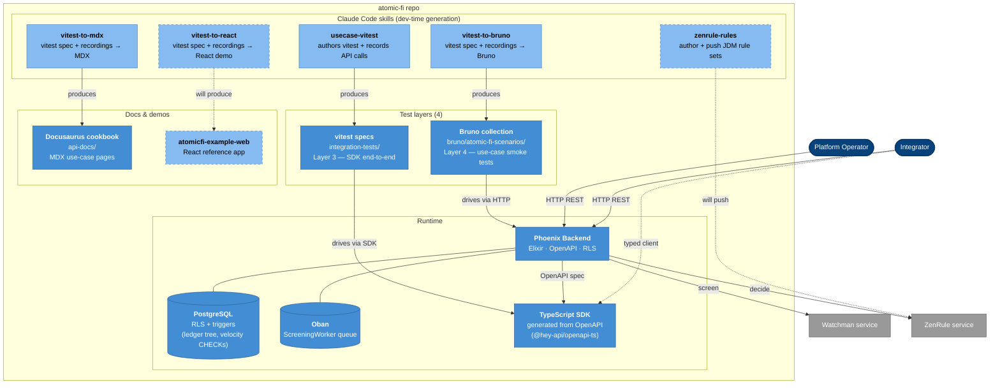
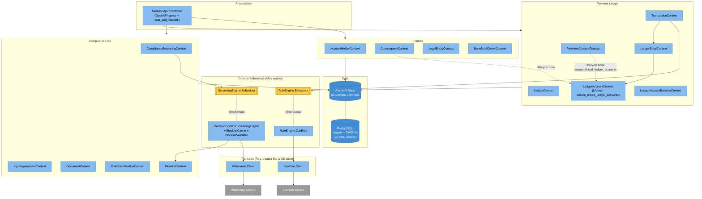

# Architecture

`atomic-fi` is a Phoenix backend exposing an OpenAPI-documented REST surface.
**There is no LiveView UI** — every capability is API-first. The codebase is
multi-tenant capable on every table (RLS via `tenant_id`) and single-tenant per
deployment by convention.

This document follows the [C4 model](https://c4model.com): three nested
diagrams (System Context → Container → Component) zoom from the outside-in.
For the per-context ERD (entities + relationships), see
[`core-modules.md`](./core-modules.md).

---

## C4 Level 1 — System Context

Who uses `atomic-fi`, and which systems it depends on.



---

## C4 Level 2 — Container View

The runnable pieces that make up the platform and its surrounding dev-time
tooling. Everything inside the dashed `atomic-fi repo` boundary lives in this
repository; the two external services live elsewhere.



Container key:
- **Solid blue** — runtime containers that ship with the platform.
- **Light blue** — dev-time tooling (Claude Code skills) used to generate
  artifacts. Skills are run once during development; their output is what
  gets committed.
- **Dashed** — future / placeholder containers and skills (`vitest-to-react`,
  `zenrule-rules`, and `atomicfi-example-web`).

---

## C4 Level 3 — Component View (inside the Phoenix Backend)

The Phoenix backend's internals — one component per context grouping. For
the full per-entity ERD and FK relationships, see
[`core-modules.md`](./core-modules.md#erd).



Behaviour boxes (yellow) are the Mox seams — every test starts with
`stub_with` the real impl, individual tests use `Mox.expect/3` to override.

---

## Layers

```
┌─────────────────────────────────────────────────────────────────────┐
│ Presentation                                                        │
│   AtomicFiApi.*Controller — Phoenix controllers, OpenAPI 3.0 specs  │
│   - Auto-generated Request / Response schemas (ExOpenApiUtils)      │
│   - Controllers NEVER massage params — pass typed structs to context│
│   - TypeScript SDK generated from the live OpenAPI document          │
└─────────────────────────────────────────────────────────────────────┘
                                  ↓
┌─────────────────────────────────────────────────────────────────────┐
│ Business Logic                                                      │
│   AtomicFi.*Context — one context per domain primitive              │
│   - Functions wrapped in `def_with_rls_and_logging` (RLS + audit)   │
│   - Lifecycle hooks (e.g. ensure_linked_ledger_accounts) wrap       │
│     write paths in Repo.transaction + Ecto.Multi                    │
│   - Domain Behaviours for external services (ScreeningEngine,       │
│     RuleEngine) — Mox seams live here, never at the HTTP transport  │
└─────────────────────────────────────────────────────────────────────┘
                                  ↓
┌─────────────────────────────────────────────────────────────────────┐
│ Data Access                                                         │
│   PostgreSQL + Ecto                                                 │
│   - Row-Level Security via `tenant_id` (enforced in AtomicFi.Repo)  │
│   - Triggers + CHECK constraints encode invariants the app trusts:  │
│       · LedgerAccount tree shape + ancestor_ids resolution          │
│       · LedgerEntry balance propagation + velocity-limit CHECKs     │
│       · descendant_ids back-fill + linked_ledger_accounts edges     │
└─────────────────────────────────────────────────────────────────────┘
                                  ↓
┌─────────────────────────────────────────────────────────────────────┐
│ External services (transport + domain Behaviour split)              │
│   Watchman.Client → ScreeningEngine.Behaviour  (sanctions / PEP)    │
│   ZenRule.Client  → RuleEngine.Behaviour       (velocity decisions) │
└─────────────────────────────────────────────────────────────────────┘
                                  ↓
┌─────────────────────────────────────────────────────────────────────┐
│ Infrastructure                                                      │
│   Oban (jobs, e.g. ScreeningWorker)                                 │
│   Logger / Telemetry                                                │
└─────────────────────────────────────────────────────────────────────┘
```

---

## Directory Structure

```
lib/
├── atomic_fi/                        # Business logic (Contexts)
│   ├── repo.ex                       # RLS-aware Ecto repo
│   ├── schema.ex                     # Base schema (TypedEctoSchema + ExOpenApiUtils)
│   ├── logger_macro.ex               # def_with_rls_and_logging
│   ├── enabled_regimes.ex            # tenant → AH → CP/PA inheritance
│   │
│   ├── account_holder_context/       # MDM subject — KYC state
│   ├── counterparty_context/         # External party relationships
│   ├── legal_entity_context/         # PII container
│   ├── beneficial_owner_context/     # FinCEN CDD chain
│   ├── compliance_screening_context/ # Screening lifecycle + matches
│   ├── kyc_requirement_context/      # Open compliance obligations
│   ├── document_context/             # Evidence pointers (S3, hashes)
│   ├── risk_classification_context/  # Risk tier + score
│   ├── blocklist_context/            # Tenant-managed deny lists
│   │
│   ├── payment_account_context/      # ISO 20022 account instruments
│   ├── ledger_context/               # Per (AH, currency) chart container
│   ├── ledger_account_context/       # Control accounts (the LA tree)
│   ├── ledger_entry_context/         # Debit/credit postings
│   ├── transaction_context/          # Debtor/creditor txn pairs
│   │
│   ├── decision_context/             # ScreeningEngine + BlocklistCache
│   ├── rule_engine.ex / zen_rule/    # RuleEngine.Behaviour + ZenRule impl
│   ├── watchman/                     # Watchman transport client
│   ├── zen_rule/                     # ZenRule transport client
│   │
│   ├── tenant_context/   user_context/   role_context/
│   ├── api_key_context/  session_context/
│   └── ...
│
└── atomic_fi_api/                    # Presentation (REST)
    ├── controllers/                  # One per resource (POST/GET/PUT/DELETE)
    ├── api_spec.ex                   # Aggregated OpenAPI document
    └── helpers/                      # cast_and_validate / json_response
```

---

## Core Patterns

### 1. RLS via `def_with_rls_and_logging`

The `AtomicFi.LoggerMacro.def_with_rls_and_logging/2` macro wraps every context
function so it (a) emits structured audit logs and (b) routes through
`AtomicFi.Repo`, which auto-filters every query by the session's `tenant_id`.

```elixir
def_with_rls_and_logging create_account_holder(session, %AccountHolderRequest{} = request),
  log_fields: [] do
  %AccountHolder{}
  |> AccountHolder.changeset(request)
  |> Repo.insert(session: session)        # ← session: scopes by tenant_id
end
```

If a caller forgets `session:`, `Repo` raises rather than leak across tenants.
For controlled cross-tenant reads use `skip_multi_tenancy_check: true`
explicitly — this is grep-able audit evidence.

### 2. Controller ↔ Context Contract

Controllers **never** call `ExOpenApiUtils.Mapper.to_map/1` or massage params.
They pass the typed Request struct straight to the context function:

```elixir
# ✅ Correct
AccountHolderContext.create_account_holder(session, %AccountHolderRequest{...})

# ❌ Wrong
attrs = ExOpenApiUtils.Mapper.to_map(account_holder_request)
AccountHolderContext.create_account_holder(session, attrs)
```

`use AtomicFi.Schema` swaps `Ecto.Changeset.cast/3` for
`ExOpenApiUtils.Changeset.cast/3`, which calls `Mapper.to_map/1` internally —
so the typed struct flows directly into `changeset/2`. See
[`api-development.md`](./api-development.md) for the full contract.

### 3. Auto-generated OpenAPI Schemas

Every schema annotated with `open_api_property` + `open_api_schema(title:
"Foo")` auto-generates `AtomicFi.OpenApiSchema.FooRequest` and
`AtomicFi.OpenApiSchema.FooResponse`. `readOnly: true` fields appear only in
responses; `writeOnly: true` only in requests.

### 4. External Service Seam (transport + domain Behaviour + Mox)

Every external HTTP integration follows the same shape:

```
                   AtomicFi.Watchman.Client          ← transport (Req)
                            ↑                          no Behaviour
                            │
       AtomicFi.DecisionContext.ScreeningEngine     ← domain module
                            ↑                          @callback returns
       AtomicFi.DecisionContext.ScreeningEngine.Behaviour      preloaded
                            ↑                          domain structs
       Application.compile_env(:atomic_fi, :screening_engine)
              │
              ├── prod  → AtomicFi.DecisionContext.ScreeningEngine
              └── test  → AtomicFi.ScreeningEngineMock (Mox)
                          DataCase auto-`stub_with`s the real impl
```

The transport client is treated like a database driver — defensive arms get
`# coveralls-ignore`. The Mox seam lives at the **domain** Behaviour layer so
tests can drive return values without setting up service state.

Same shape for `RuleEngine.Behaviour` over `AtomicFi.ZenRule.Client`.

### 5. Trigger-Enforced Invariants

The application trusts the database to enforce structural invariants. Two
examples in the payment-ledger subtree:

**LedgerAccount tree.** Six `la_type` shapes form a strict tree per
`(Ledger, regime, payment_account_id, counterparty_id)`. A
`BEFORE INSERT/UPDATE` trigger resolves `ancestor_ids` by `la_type`-dispatched
lookup and **fails fast** (SQLSTATE 23514, CONSTRAINT
`ledger_accounts_ancestor_resolution`) when a required `*_root` is missing —
mapped to an `%Ecto.Changeset{}` error by `check_constraint/3` on the schema.
An `AFTER INSERT` trigger back-fills `descendant_ids` on every ancestor and
refreshes the `linked_ledger_accounts` edge table.

**Velocity limits.** Each `LedgerEntry.limits_at_entry` (`velocity_limit[]`)
travels with the entry; a `BEFORE INSERT` trigger fans the limits into the
flat `ledger_account_balances.last_*_limit` columns. DB `CHECK` constraints
fire on breach, the trigger voids the entry and records
`rejected_ledger_account_id / rejected_period / rejected_direction /
rejected_rule / rejected_code`. The transaction flow re-records both legs as
`:voided` so the ledger stays balanced.

### 6. Lifecycle Hooks (Ecto.Multi)

Some writes have downstream materialisation that must happen in the same
transaction. Example: `PaymentAccountContext.create/update_payment_account`
calls `LedgerAccountContext.ensure_linked_ledger_accounts/2`, which builds an
`Ecto.Multi` that inserts the AH-PA root then a regime-root per
`enabled_regime`. Root-first ordering is mandatory because the BEFORE-INSERT
trigger above would otherwise reject each regime row. The entire chain runs
under one `Repo.transaction` so any trigger-side error rolls the PA write
back too.

---

## Multi-Tenancy

`config/config.exs` declares the RLS configuration:

```elixir
config :atomic_fi,
  rls_fields: [:tenant_id],
  rls_primary_field: :tenant_id,
  rls_primary_table: :tenants,
  rls_primary_module: AtomicFi.TenantContext.Tenant
```

The `Tenant` schema itself uses a virtual `tenant_id` that mirrors `id` via
`GENERATED ALWAYS AS (id) STORED` — so RLS queries work uniformly across
every schema including `Tenant`. See
[`multi-tenancy.md`](./multi-tenancy.md).

---

## Background Jobs

Oban runs on the `:compliance_screening` queue (and others as needed). The
canonical job is `AtomicFi.ComplianceScreeningContext.ScreeningWorker`,
enqueued automatically when `AccountHolderRequest.chain_screening` or
`CounterpartyRequest.chain_screening` is `true`:

```elixir
%{subject: "counterparty", counterparty_id: cp.id, tenant_id: cp.tenant_id}
|> ScreeningWorker.new()
|> Oban.insert!()
```

---

## Testing Layers

Tests run in strict bottom-up order — never jump layers:

| Layer | Tool | Lives in | What it tests |
|---|---|---|---|
| 1 | ExUnit + `DataCase` | `test/atomic_fi/` | Context functions against real Postgres (no mocks). |
| 2 | ExUnit + `ConnCase` | `test/atomic_fi_api/controllers/` | HTTP surface — request shape, response schema, status codes, RLS isolation. |
| 3 | vitest | `integration-tests/tests/` | End-to-end against a running server, exercising the TypeScript SDK. |
| 4 | Bruno | `bruno/atomic-fi-scenarios/` | Scenario flows (onboarding → screening → transaction) hitting the live API. |

Mox seams (`ScreeningEngineMock`, `RuleEngineMock`) default to `stub_with`
the real impl, so existing tests continue to hit Watchman / ZenRule unless a
specific test overrides with `Mox.expect/3`. See
[`testing.md`](./testing.md).

---

## Security

- **Authentication** — bcrypt passwords + TOTP 2FA for human users
  (`User`), bearer API keys for machines (`ApiKey`). Both authenticate into
  a `Session` carrying `tenant_id` + `role`.
- **Authorization** — `Role` + `UserRoleMapping`; the session's role drives
  controller plug guards.
- **RLS** — every query routes through `AtomicFi.Repo`, which injects the
  session's `tenant_id` filter automatically.
- **Audit** — every context call emits a structured log via
  `def_with_rls_and_logging`. See [`authentication.md`](./authentication.md).

---

## See Also

- [`core-modules.md`](./core-modules.md) — domain contexts + ERD
- [`capability-matrix.md`](./capability-matrix.md) — per-context implementation status
- [`multi-tenancy.md`](./multi-tenancy.md) — RLS plumbing
- [`api-development.md`](./api-development.md) — controller ↔ context contract
- [`testing.md`](./testing.md) — the four test layers
