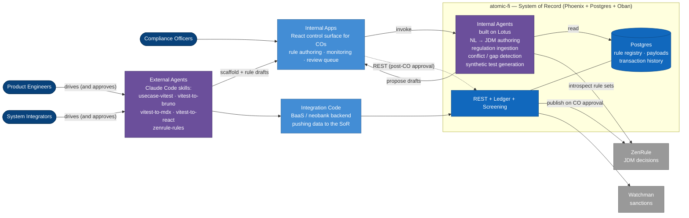
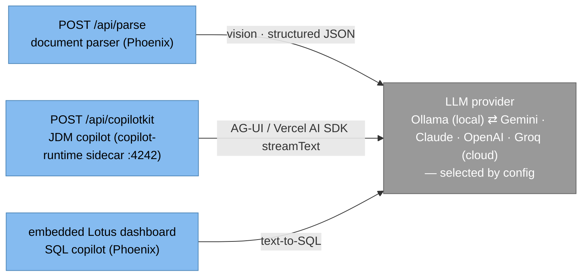

# Architecture

`atomic-fi` is a Phoenix backend exposing an OpenAPI-documented REST surface.
**There is no LiveView UI** — every capability is API-first. The codebase is
multi-tenant capable on every table (RLS via `tenant_id`) and single-tenant per
deployment by convention.

For the per-context ERD (entities + relationships) see
[`core-modules.md`](./core-modules.md).

---

## C4 — Operators and what they do

Convention: **agents are first-class operators** alongside humans, **but no
agent — external or internal — mutates state without explicit human
approval**. Agents *propose* (author rules, draft tests, suggest patches);
humans *approve* (Product Engineer running the skill, Compliance Officer
clicking through the UI). The publish path is always:

```
agent proposal  →  human review  →  REST mutation  →  downstream effect
```

Two agent flavours:

- **External Agents** — Claude Code skills running outside the platform at
  dev time. Generate code, scaffold tests/docs, draft JDM rule sets. Driven
  by Product Engineers / System Integrators who review and approve each step.
- **Internal Agents** — long-running agents **inside `atomic-fi`** itself,
  built on the [Lotus](https://github.com/alvera-ai/lotus) Elixir
  open-source agent framework (in-process, no extra service). First-class
  access to the rule registry, enriched payloads, and transaction history.
  Natural-language → JDM rule authoring, regulation ingestion, conflict &
  gap detection, synthetic test generation. Exposed via REST and consumed
  by Internal Apps.



```
   WHO DOES WHAT
   ───────────────────────────────────────────────────────────────────
     COMPLIANCE OFFICERS    work inside Internal Apps. The app invokes
                            Internal Agents (running inside atomic-fi) for
                            NL → JDM authoring, conflict checks, synthetic
                            tests. CO reviews + signs off before live.

     PRODUCT ENGINEERS      drive External Agents to scaffold the Internal
                            Apps themselves and to author + push initial
                            JDM rule sets at platform-build time.

     SYSTEM INTEGRATORS     drive External Agents to generate the
                            integration code their BaaS / neobank backend
                            uses to push data into the SoR — vitest specs
                            that double as live-request records, Bruno
                            collections that double as runnable smoke tests.

     INTERNAL AGENTS        run inside atomic-fi (Lotus / Elixir, in-process)
                            with first-class access to the rule registry,
                            enriched payloads, and transaction history.
                            Propose drafts via REST — they NEVER mutate
                            state or publish rules directly. Publish flows
                            atomic-fi REST → ZenRule only after a CO
                            approves the draft in the Internal App.

     EXTERNAL AGENTS        Claude Code skills run outside the platform.
                            One-shot at dev time. DRAFT artifacts (vitest
                            specs, Bruno collections, MDX, React demos,
                            JDM rule JSON). Never talk to ZenRule directly —
                            rule drafts land in Internal Apps for CO review,
                            and only the human-approved path
                            (Internal App → atomic-fi REST → ZenRule)
                            actually publishes a rule.
```

---

## C4 — Components inside `atomic-fi`

Zoom into the Phoenix backend container. Components grouped by domain; the
two external services attach via transport clients beneath the domain
Behaviours. The full per-entity ERD is in
[`core-modules.md`](./core-modules.md#erd).

```mermaid
flowchart TB
    classDef component fill:#85bbf0,stroke:#4f87b8,color:#000
    classDef behaviour fill:#fbcb4a,stroke:#a37c00,color:#000
    classDef agent fill:#6b4f9b,stroke:#3f2d67,color:#fff
    classDef datastore fill:#438dd5,stroke:#2e6295,color:#fff
    classDef external fill:#999,stroke:#666,color:#fff

    controllers["AtomicFiApi.*Controller<br/>(OpenAPI + cast_and_validate)"]:::component

    subgraph parties ["Parties"]
        ah[AccountHolderContext]:::component
        cp[CounterpartyContext]:::component
        le[LegalEntityContext]:::component
        bo[BeneficialOwnerContext]:::component
    end

    subgraph compliance ["Compliance Ops"]
        screening[ComplianceScreeningContext]:::component
        kyc[KycRequirementContext]:::component
        doc[DocumentContext]:::component
        risk[RiskClassificationContext]:::component
        blocklist[BlocklistContext]:::component
    end

    subgraph ledger ["Payment Ledger"]
        pa[PaymentAccountContext]:::component
        ledger_ctx[LedgerContext]:::component
        la["LedgerAccountContext<br/>(LA tree · ensure_linked_ledger_accounts)"]:::component
        lab[LedgerAccountBalanceContext]:::component
        le_entry[LedgerEntryContext]:::component
        txn[TransactionContext]:::component
    end

    subgraph decision ["Decision Engines (domain Behaviours)"]
        screening_eng[[ScreeningEngine.Behaviour]]:::behaviour
        screening_impl["DecisionContext.ScreeningEngine<br/>+ BlocklistCache + BlocklistValidator"]:::component
        rule_eng[[RuleEngine.Behaviour]]:::behaviour
        zenrule_impl[RuleEngine.ZenRule]:::component
    end

    subgraph transport ["Transport (Req — DB-driver equivalent)"]
        watchman_client[Watchman.Client]:::component
        zenrule_client[ZenRule.Client]:::component
    end

    int_agents[Internal Agents<br/>built on Lotus]:::agent

    subgraph data ["Data"]
        repo[(AtomicFi.Repo<br/>RLS-aware Ecto)]:::datastore
        triggers[(PostgreSQL<br/>triggers + CHECKs)]:::datastore
    end

    watchman_ext[Watchman]:::external
    zenrule_ext[ZenRule]:::external

    controllers --> parties
    controllers --> compliance
    controllers --> ledger
    controllers --> int_agents

    screening --> screening_eng
    txn --> rule_eng

    screening_eng -. impl .- screening_impl
    rule_eng      -. impl .- zenrule_impl

    screening_impl --> watchman_client
    screening_impl --> blocklist
    zenrule_impl   --> zenrule_client

    watchman_client --> watchman_ext
    zenrule_client  --> zenrule_ext

    pa  -. "lifecycle hook" .-> la
    cp  -. "lifecycle hook" .-> la
    txn --> le_entry
    le_entry --> la

    int_agents -- "read" --> repo
    int_agents -- "introspect rule sets" --> zenrule_client

    parties    --> repo
    compliance --> repo
    ledger     --> repo
    repo --- triggers
```



Yellow boxes are domain `@behaviour` definitions — the architectural
boundary above the HTTP transport. Production code only sees preloaded
domain structs going in and decoded results coming out, never raw
Watchman / ZenRule JSON. The transport clients (blue, below) are treated
like database drivers.

---

## AI Features — the LLM provider

Three capabilities call an LLM. The provider is **pluggable** — a local
**Ollama** daemon by default (no API keys), or a cloud LLM (Gemini,
Claude, OpenAI) selected by config. Same architecture either way; only a
model string changes, never code.



| Feature | Surface | Job | Local default | Cloud example |
|---|---|---|---|---|
| Document parser | `POST /api/parse` (Phoenix) | vision extraction | `llama3.2-vision:11b` | `google:gemini-1.5-pro` |
| JDM copilot | `POST /api/copilotkit` (copilot-runtime sidecar) | reasoning + tool-calling | `qwen3.5:9b` | `anthropic:claude-…` |
| Lotus SQL copilot | embedded Lotus dashboard | text-to-SQL | `qwen3.5:9b` | `openai:gpt-…` |

Parser + Lotus call the LLM from Phoenix via ReqLLM. The JDM copilot is
the exception — it speaks CopilotKit v2's AG-UI protocol, which ships
only as JS library middleware, so a small **generic copilot-runtime
sidecar** (`external-deps/copilot-runtime/`, Bun + Hono + Vercel AI SDK)
brokers the LLM call. The editor's React client posts to that sidecar's
`/api/copilotkit` directly; the sidecar holds zero domain logic — its
job is provider-switching and AG-UI stream shaping. Same pluggable-LLM
property either way: a config change moves any feature between local
Ollama and a cloud provider, no code moves.

Configuration lives in `config :atomic_fi, :document_parser`,
`external-deps/copilot-runtime/docker.env` (`LLM_PROVIDER`, `LLM_MODEL`,
`OLLAMA_BASE_URL`), and `config :lotus, :ai`. The sidecar is started by
`make run-backing-services` alongside ZenRule + Watchman.

### Thinking vs non-thinking models

A *thinking* model emits a hidden reasoning pass before its answer, which
corrupts **schema-constrained JSON**. Ollama can disable it
(`think: false`) on its native `/api/chat` endpoint but **not** on the
OpenAI-compatible `/v1/` endpoint — the OpenAI API spec has no such
field. So on the **local Ollama** path:

- **Vision / document parsing** needs schema-constrained JSON → uses a
  **non-thinking** vision model (`llama3.2-vision:11b`); Ollama's `/v1/`
  endpoint then honours `response_format: json_schema` and returns
  schema-valid JSON.
- **SQL and JDM-rule generation** *benefit* from reasoning and emit
  free-form text the caller parses (a SQL string, a tool call) → use a
  **thinking** model (`qwen3.5:9b`).

Cloud providers handle structured output natively — the distinction is a
local-Ollama deployment detail only.

### Document parser — PDF → structured JSON

No local vision model ingests a PDF *file*; Poppler rasterises it first —
the model receives page images plus the extracted text layer:

```
   PDF ─┬─ pdftoppm  → one PNG per page  ──┐
        └─ pdftotext → embedded text ──────┤
   image (jpg/png) ───────────────────────┤  (used as-is)
                                           ▼
                  LLM vision call  →  schema-valid JSON
```

Cloud providers (Gemini, Claude) accept a PDF directly — their backend
runs this same rasterise step server-side.

### Copilot streaming — `/api/copilotkit` (copilot-runtime sidecar)

The JDM editor's React copilot speaks **CopilotKit v2 / AG-UI** to the
generic sidecar at `:4242`. The sidecar bundles
`@copilotkit/runtime/v2` + Hono on Bun, and uses a `BuiltInAgent` in
`"aisdk"` Factory Mode — every turn the sidecar runs Vercel AI SDK's
`streamText`, returns its result, and CopilotKit converts the stream
into AG-UI events the client renders.

- `availableAgents` / `loadAgentState` — one-shot JSON.
- `runAgent` — SSE (`text/event-stream`) carrying AG-UI events
  (`RUN_STARTED` / `TEXT_MESSAGE_CHUNK` / `TOOL_CALL_*` / `RUN_FINISHED`).
- A 15 s transport-level keepalive (`: keepalive\n\n` comment frames)
  prevents Bun's idle timer + downstream proxies from closing the
  socket during the LLM's silent prompt-eval window.

No WebSocket; tool round-trips are chained HTTP requests with the full
conversation in the `messages` array. The sidecar holds no domain
logic — the JDM authoring system prompt + the 11 HITL tool schemas
live in the editor (`src/copilot/`).

### Rule storage — `zen_rules/` source vs `priv/zenrule/` runtime

Demo rules are committed at `zen_rules/<rule_type>/<name>.json` (source
of truth) and copied to `priv/zenrule/<rule_type>/` by
`make hydrate-zen-rules` (a dependency of `make run-backing-services`).
ZenRule's container bind-mounts `priv/zenrule/` read-only and polls
every ~5 s for changes — so writes from the editor's `save_rule`
action (via Phoenix's REST proxy) become evaluable shortly after the
HTTP write returns. Same pattern as the Vite-built SPAs: committed
source at the repo root, gitignored runtime location under `priv/`.

---

## Layers

```
┌─────────────────────────────────────────────────────────────────────┐
│ Presentation                                                        │
│   AtomicFiApi.*Controller — Phoenix controllers, OpenAPI 3.0 specs  │
│   - Auto-generated Request / Response schemas (ExOpenApiUtils)      │
│   - Controllers NEVER massage params — pass typed structs to context│
│   - TypeScript SDK generated from the live OpenAPI document          │
└─────────────────────────────────────────────────────────────────────┘
                                  ↓
┌─────────────────────────────────────────────────────────────────────┐
│ Business Logic                                                      │
│   AtomicFi.*Context — one context per domain primitive              │
│   - Functions wrapped in `def_with_rls_and_logging` (RLS + audit)   │
│   - Lifecycle hooks (e.g. ensure_linked_ledger_accounts) wrap       │
│     write paths in Repo.transaction + Ecto.Multi                    │
│   - Domain Behaviours for external services (ScreeningEngine,       │
│     RuleEngine) — take preloaded domain structs, return decoded     │
│     results; the HTTP transport sits below the Behaviour            │
└─────────────────────────────────────────────────────────────────────┘
                                  ↓
┌─────────────────────────────────────────────────────────────────────┐
│ Data Access                                                         │
│   PostgreSQL + Ecto                                                 │
│   - Row-Level Security via `tenant_id` (enforced in AtomicFi.Repo)  │
│   - Triggers + CHECK constraints encode invariants the app trusts:  │
│       · LedgerAccount tree shape + ancestor_ids resolution          │
│       · LedgerEntry balance propagation + velocity-limit CHECKs     │
│       · descendant_ids back-fill + linked_ledger_accounts edges     │
└─────────────────────────────────────────────────────────────────────┘
                                  ↓
┌─────────────────────────────────────────────────────────────────────┐
│ External services (transport + domain Behaviour split)              │
│   Watchman.Client → ScreeningEngine.Behaviour  (sanctions / PEP)    │
│   ZenRule.Client  → RuleEngine.Behaviour       (velocity decisions) │
└─────────────────────────────────────────────────────────────────────┘
                                  ↓
┌─────────────────────────────────────────────────────────────────────┐
│ Infrastructure                                                      │
│   Oban (jobs, e.g. ScreeningWorker)                                 │
│   Logger / Telemetry                                                │
└─────────────────────────────────────────────────────────────────────┘
```

---

## Directory Structure

```
lib/
├── atomic_fi/                        # Business logic (Contexts)
│   ├── repo.ex                       # RLS-aware Ecto repo
│   ├── schema.ex                     # Base schema (TypedEctoSchema + ExOpenApiUtils)
│   ├── logger_macro.ex               # def_with_rls_and_logging
│   ├── enabled_regimes.ex            # tenant → AH → CP/PA inheritance
│   │
│   ├── account_holder_context/       # MDM subject — KYC state
│   ├── counterparty_context/         # External party relationships
│   ├── legal_entity_context/         # PII container
│   ├── beneficial_owner_context/     # FinCEN CDD chain
│   ├── compliance_screening_context/ # Screening lifecycle + matches
│   ├── kyc_requirement_context/      # Open compliance obligations
│   ├── document_context/             # Evidence pointers (S3, hashes)
│   ├── risk_classification_context/  # Risk tier + score
│   ├── blocklist_context/            # Tenant-managed deny lists
│   │
│   ├── payment_account_context/      # ISO 20022 account instruments
│   ├── ledger_context/               # Per (AH, currency) chart container
│   ├── ledger_account_context/       # Control accounts (the LA tree)
│   ├── ledger_entry_context/         # Debit/credit postings
│   ├── transaction_context/          # Debtor/creditor txn pairs
│   │
│   ├── decision_context/             # ScreeningEngine + BlocklistCache
│   ├── rule_engine.ex / zen_rule/    # RuleEngine.Behaviour + ZenRule impl
│   ├── watchman/                     # Watchman transport client
│   ├── zen_rule/                     # ZenRule transport client
│   │
│   ├── tenant_context/   user_context/   role_context/
│   ├── api_key_context/  session_context/
│   └── ...
│
└── atomic_fi_api/                    # Presentation (REST)
    ├── controllers/                  # One per resource (POST/GET/PUT/DELETE)
    ├── api_spec.ex                   # Aggregated OpenAPI document
    └── helpers/                      # cast_and_validate / json_response
```

---

## Core Patterns

### 1. RLS via `def_with_rls_and_logging`

The `AtomicFi.LoggerMacro.def_with_rls_and_logging/2` macro wraps every context
function so it (a) emits structured audit logs and (b) routes through
`AtomicFi.Repo`, which auto-filters every query by the session's `tenant_id`.

```elixir
def_with_rls_and_logging create_account_holder(session, %AccountHolderRequest{} = request),
  log_fields: [] do
  %AccountHolder{}
  |> AccountHolder.changeset(request)
  |> Repo.insert(session: session)        # ← session: scopes by tenant_id
end
```

If a caller forgets `session:`, `Repo` raises rather than leak across tenants.
For controlled cross-tenant reads use `skip_multi_tenancy_check: true`
explicitly — this is grep-able audit evidence.

### 2. Controller ↔ Context Contract

Controllers **never** call `ExOpenApiUtils.Mapper.to_map/1` or massage params.
They pass the typed Request struct straight to the context function:

```elixir
# ✅ Correct
AccountHolderContext.create_account_holder(session, %AccountHolderRequest{...})

# ❌ Wrong
attrs = ExOpenApiUtils.Mapper.to_map(account_holder_request)
AccountHolderContext.create_account_holder(session, attrs)
```

`use AtomicFi.Schema` swaps `Ecto.Changeset.cast/3` for
`ExOpenApiUtils.Changeset.cast/3`, which calls `Mapper.to_map/1` internally —
so the typed struct flows directly into `changeset/2`. See
[`api-development.md`](./api-development.md) for the full contract.

### 3. Auto-generated OpenAPI Schemas

Every schema annotated with `open_api_property` + `open_api_schema(title:
"Foo")` auto-generates `AtomicFi.OpenApiSchema.FooRequest` and
`AtomicFi.OpenApiSchema.FooResponse`. `readOnly: true` fields appear only in
responses; `writeOnly: true` only in requests.

### 4. External Service Seam (transport + domain Behaviour)

Every external HTTP integration follows the same shape:

```
            AtomicFi.Watchman.Client         ← transport (Req)
                     ↑                         no Behaviour, treated
                     │                         like a database driver
   AtomicFi.DecisionContext.ScreeningEngine  ← domain module
                     ↑                         @callback takes preloaded
   ScreeningEngine.Behaviour                   domain structs (AH, CP, …)
                     ↑                         and returns matches
   Application.compile_env(:atomic_fi, :screening_engine)
                     │
                     └── runtime impl picked here
```

The transport client is treated like a database driver — defensive arms get
`# coveralls-ignore`. The domain Behaviour is the architectural boundary —
above it the rest of the codebase only sees preloaded domain structs going
in and decoded results coming out, never raw HTTP. Same shape for
`RuleEngine.Behaviour` over `AtomicFi.ZenRule.Client`. (How tests double
the Behaviour with Mox is in [`testing.md`](./testing.md).)

### 5. Trigger-Enforced Invariants

The application trusts the database to enforce structural invariants. Two
examples in the payment-ledger subtree:

**LedgerAccount tree.** Six `la_type` shapes form a strict tree per
`(Ledger, regime, payment_account_id, counterparty_id)`. A
`BEFORE INSERT/UPDATE` trigger resolves `ancestor_ids` by `la_type`-dispatched
lookup and **fails fast** (SQLSTATE 23514, CONSTRAINT
`ledger_accounts_ancestor_resolution`) when a required `*_root` is missing —
mapped to an `%Ecto.Changeset{}` error by `check_constraint/3` on the schema.
An `AFTER INSERT` trigger back-fills `descendant_ids` on every ancestor and
refreshes the `linked_ledger_accounts` edge table.

**Velocity limits.** Each `LedgerEntry.limits_at_entry` (`velocity_limit[]`)
travels with the entry; a `BEFORE INSERT` trigger fans the limits into the
flat `ledger_account_balances.last_*_limit` columns. DB `CHECK` constraints
fire on breach, the trigger voids the entry and records
`rejected_ledger_account_id / rejected_period / rejected_direction /
rejected_rule / rejected_code`. The transaction flow re-records both legs as
`:voided` so the ledger stays balanced.

### 6. Lifecycle Hooks (Ecto.Multi)

Some writes have downstream materialisation that must happen in the same
transaction. Example: `PaymentAccountContext.create/update_payment_account`
calls `LedgerAccountContext.ensure_linked_ledger_accounts/2`, which builds an
`Ecto.Multi` that inserts the AH-PA root then a regime-root per
`enabled_regime`. Root-first ordering is mandatory because the BEFORE-INSERT
trigger above would otherwise reject each regime row. The entire chain runs
under one `Repo.transaction` so any trigger-side error rolls the PA write
back too.

---

## Multi-Tenancy

`config/config.exs` declares the RLS configuration:

```elixir
config :atomic_fi,
  rls_fields: [:tenant_id],
  rls_primary_field: :tenant_id,
  rls_primary_table: :tenants,
  rls_primary_module: AtomicFi.TenantContext.Tenant
```

The `Tenant` schema itself uses a virtual `tenant_id` that mirrors `id` via
`GENERATED ALWAYS AS (id) STORED` — so RLS queries work uniformly across
every schema including `Tenant`. See
[`multi-tenancy.md`](./multi-tenancy.md).

---

## Background Jobs

Oban runs on the `:compliance_screening` queue (and others as needed). The
canonical job is `AtomicFi.ComplianceScreeningContext.ScreeningWorker`,
enqueued automatically when `AccountHolderRequest.chain_screening` or
`CounterpartyRequest.chain_screening` is `true`:

```elixir
%{subject: "counterparty", counterparty_id: cp.id, tenant_id: cp.tenant_id}
|> ScreeningWorker.new()
|> Oban.insert!()
```

---

## Testing Layers

Tests run in strict bottom-up order — never jump layers:

| Layer | Tool | Lives in | What it tests |
|---|---|---|---|
| 1 | ExUnit + `DataCase` | `test/atomic_fi/` | Context functions against real Postgres (no mocks). |
| 2 | ExUnit + `ConnCase` | `test/atomic_fi_api/controllers/` | HTTP surface — request shape, response schema, status codes, RLS isolation. |
| 3 | vitest | `integration-tests/tests/` | End-to-end against a running server, exercising the TypeScript SDK. |
| 4 | Bruno | `bruno/atomic-fi-scenarios/` | Scenario flows (onboarding → screening → transaction) hitting the live API. |

By default, tests hit the live Watchman / ZenRule via the production
Behaviour impl; individual tests can swap in a double at the Behaviour
layer when they need to drive specific return values. See
[`testing.md`](./testing.md).

---

## Security

- **Authentication** — bcrypt passwords + TOTP 2FA for human users
  (`User`), bearer API keys for machines (`ApiKey`). Both authenticate into
  a `Session` carrying `tenant_id` + `role`.
- **Authorization** — `Role` + `UserRoleMapping`; the session's role drives
  controller plug guards.
- **RLS** — every query routes through `AtomicFi.Repo`, which injects the
  session's `tenant_id` filter automatically.
- **Audit** — every context call emits a structured log via
  `def_with_rls_and_logging`. See [`authentication.md`](./authentication.md).

---

## See Also

- [`core-modules.md`](./core-modules.md) — domain contexts + ERD
- [`capability-matrix.md`](./capability-matrix.md) — per-context implementation status
- [`multi-tenancy.md`](./multi-tenancy.md) — RLS plumbing
- [`api-development.md`](./api-development.md) — controller ↔ context contract
- [`testing.md`](./testing.md) — the four test layers
