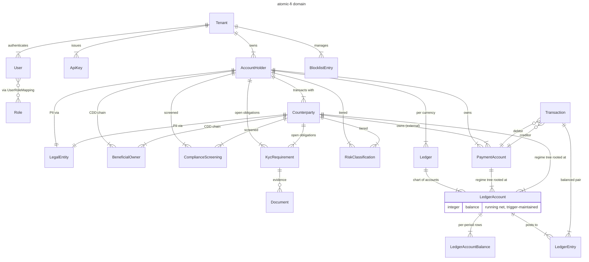

# Core Modules

`atomic-fi` is an OSS Phoenix **payments compliance platform** — a white-label
backend any neobank, BaaS, or fintech can deploy as their compliance SoR.
Primitives mirror **FATF** and **ISO 20022** so regulatory mapping is mechanical.
The platform is **API-first** — no LiveView UI.

---

## Domains

| Domain | Contexts | Owns |
|---|---|---|
| **Identity & Auth** | `Tenant`, `User`, `Role`, `ApiKey`, `Session` | Multi-tenancy partition, RBAC, bearer auth. |
| **Parties** | `AccountHolder`, `Counterparty`, `LegalEntity`, `BeneficialOwner` | MDM subjects + PII container + FinCEN CDD chain. |
| **Compliance Ops** | `ComplianceScreening`, `Blocklist`, `KycRequirement`, `Document`, `RiskClassification` | Screening lifecycle, sanctions/blocklist hits, KYC obligations + evidence, risk tiers. |
| **Payment Ledger** | `PaymentAccount`, `Ledger`, `LedgerAccount`, `LedgerEntry`, `Transaction` | ISO 20022 instruments + double-entry bookkeeping with DB-enforced velocity limits. |
| **Snapshots** | `AccountActivitySnapshot`, `PartyActivitySnapshot` | Periodic activity rollups consumed by the rule engine. |
| **Screening Engine** | `DecisionContext.ScreeningEngine`, `BlocklistCache`, `BlocklistValidator` | Domain `Behaviour` over `Watchman.Client` + `Blocklist`. Takes preloaded `AccountHolder`/`Counterparty`/`LegalEntity`/`BeneficialOwner` structs, returns `{:clear \| :hits, matches}`. Mox seam at the domain layer; transport (`Watchman.Client`) treated like a DB driver. |
| **Rule Engine** | `RuleEngine`, `RuleEngine.Behaviour`, `RuleEngine.ZenRule` | Domain `Behaviour` returning per-`LedgerAccount` velocity limits for a transaction. `ZenRule` is the production impl over `ZenRule.Client`; Mox seam same pattern. |

For the broader ecosystem (Bruno use-cases, vitest, dev-time Claude Code
skills that generate them, the planned React reference app, external
Watchman + ZenRule services), see the **C4 diagrams** in
[`architecture.md`](./architecture.md#c4-level-1--system-context).

Per-context implementation status (Schema / Docs / Tests / RLS / API /
Vitest / Bruno) lives in [`capability-matrix.md`](./capability-matrix.md).

---

## Personas

API-only — three consumers:

1. **Platform operator** — bearer-session, elevated role; configures tenants,
   roles, blocklists, KYC templates, rules.
2. **Integrator** (BaaS / neobank backend) — API key; orchestrates onboarding
   (AH + LE + KYC + screening) and submits transactions.
3. **Compliance officer / auditor** — bearer-session, read-only role; queries
   screening histories, beneficial-ownership chains, ledger entries, voided
   transactions with `rejected_*` metadata.

---

## ERD

The `LedgerAccount` subtree is a strict tree with 6 `la_type` shapes
(`*_root` + `*_regime_root` per CP / AH-PA / CP-PA branch), enforced by
PostgreSQL CHECK constraints and triggers. See
[`architecture.md`](./architecture.md) for the full tree contract.

---

## See Also

- [`architecture.md`](./architecture.md) — layered architecture + LedgerAccount tree
- [`capability-matrix.md`](./capability-matrix.md) — per-context implementation status
- [`use-cases.md`](./use-cases.md) — reference scenarios driving vitest + Bruno coverage
