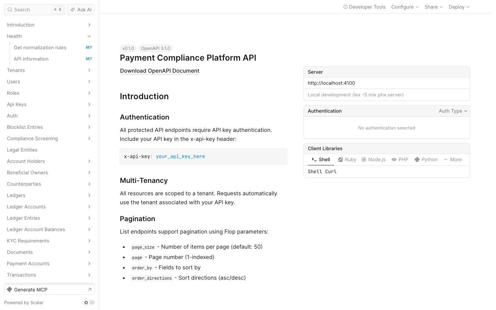
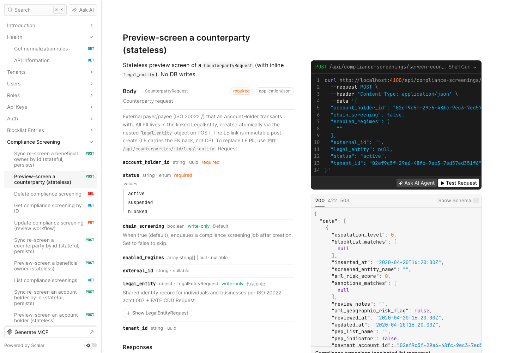
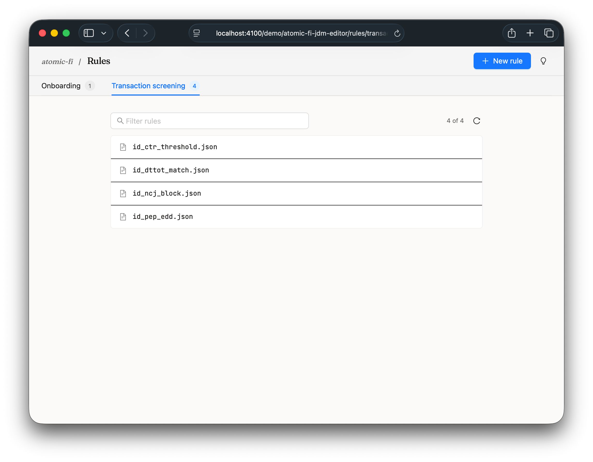
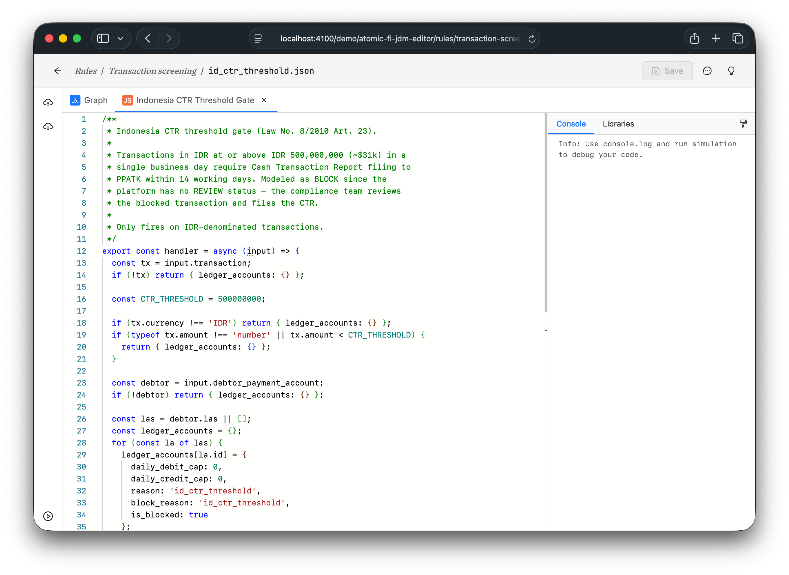
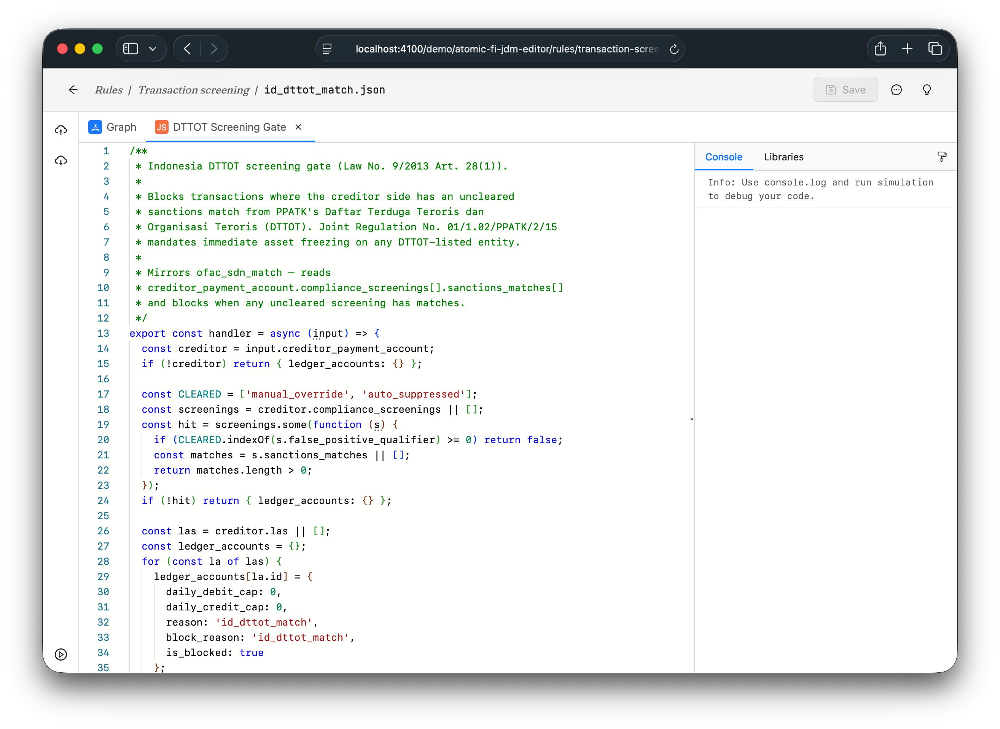
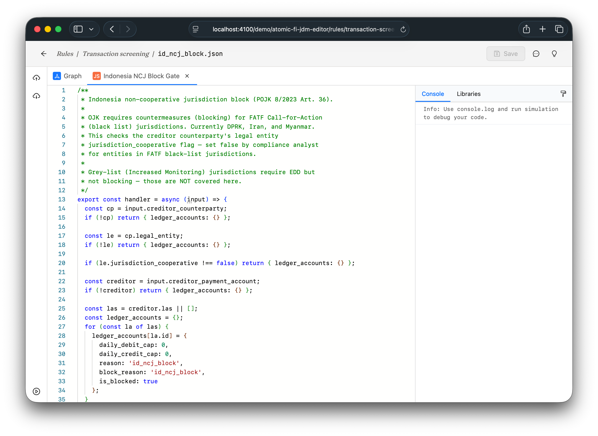
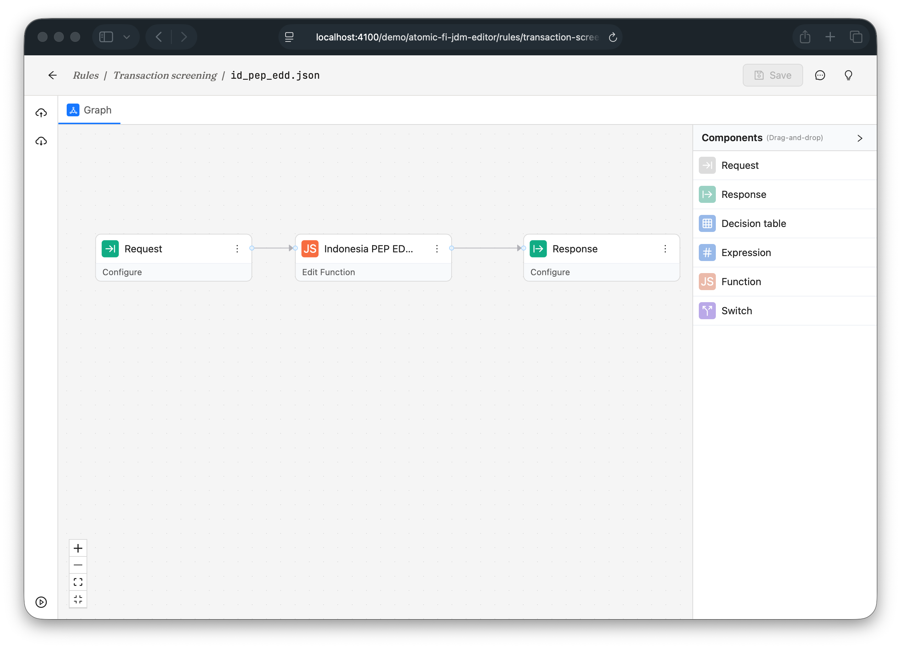
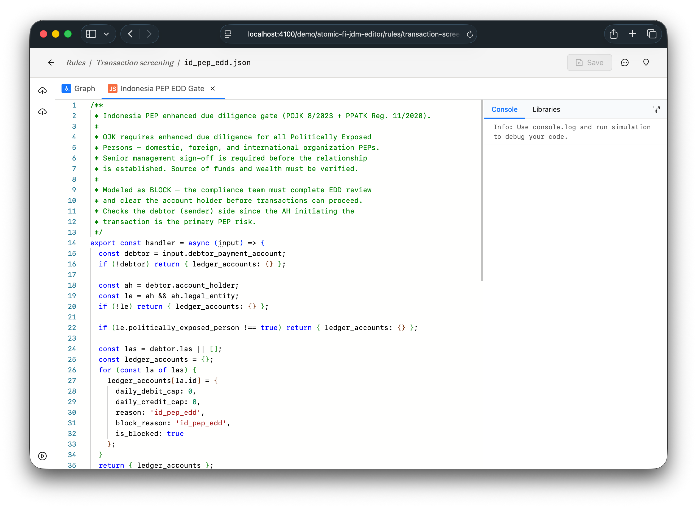

# Launch AtomicFi in a New Country — Indonesia

**How a compliance officer sets up a new country's anti-money-laundering and sanctions controls on AtomicFi, and proves the platform enforces them.**

**Documentation date:** _pending_
**Command used:** `/country-onboarding --country ID`
**Status:** In progress

---

## Who this is for

A **compliance officer** with a launch on the calendar:

> "We're expanding to Indonesia. Before day one I need the full set of sanctions and anti-money-laundering controls in place, and I need to prove — to my board and to the regulator — that the platform actually enforces them."

A compliance officer thinks in **countries**, not in legal section numbers. This guide starts from a country and ends with an evidence pack a regulator can re-run.

---

## Table of Contents

1. [Discover the rules](#1-discover-the-rules)
2. [Load the sanctions list](#2-load-the-sanctions-list)
3. [Write the controls](#3-write-the-controls)
4. [Prove the controls](#4-prove-the-controls)
5. [Runnable evidence (Bruno)](#5-runnable-evidence-bruno)
6. [Question the results (Lotus)](#6-question-the-results-lotus)
7. [The evidence pack](#7-the-evidence-pack)

---

## 1. Discover the rules

**What the officer is trying to do:** _Find out what Indonesia actually requires — which sanctions lists, and what cash-reporting threshold — without hand-collecting legal citations._

**Command or screen:**

```
/country-onboarding --country ID
```

The platform does not ask the officer to supply lists or section numbers. It looks them up — querying a public, regularly-maintained sanctions database for everything published under Indonesia's country code.

**What came back:**

Two Indonesian datasets exist; only one is a sanctions list, and the platform keeps only that one:

| Dataset | What it is | Records | Used? |
|---|---|---|---|
| Suspected terrorists & terrorist organizations | Indonesia's official designated-persons list | 1,074 | Yes — this is the sanctions screen |
| 2018 regional election results | Election data, not a sanctions list | 978 | No — discarded, it is not compliance data |

The platform also resolves Indonesia's reporting regime:

| Item | Value |
|---|---|
| Financial intelligence unit (the reporting authority) | Indonesian Financial Transaction Reports and Analysis Centre |
| Large-cash-transaction reporting threshold | 500,000,000 Indonesian rupiah (about 31,000 US dollars) |
| Governing regulation | Indonesian Financial Services Authority Regulation 12 of 2017 |

The platform that enforces all of this is a single compliance interface — every control referenced below (screening, account holders, counterparties, ledgers) is exposed here:



**Status:** Done — Indonesia resolves to one usable sanctions list and a known cash-reporting threshold. The election dataset was correctly left out.

---

## 2. Load the sanctions list

**What the officer is trying to do:** _Make the platform screen every party against Indonesia's official list of suspected terrorists and terrorist organizations — as a first-class list, exactly like the United States and United Nations lists._

**Command or screen:**

The Indonesian list is treated the same way as every other sanctions list: a committed file is placed where the screening service looks for its data, and the service loads it into memory at startup. No special database, no upload step.

```
watchlists/id/id_dttot.senzing.json        committed list (536 parties)
        │  make hydrate-watchlists           (places it where the service reads its data)
        ▼
screening service starts → loads the list into its in-memory index
```

The committed list holds 536 screenable parties (419 people, 117 organizations); the remaining records from the source are list metadata, not parties, and are left out.

**What came back:**

At startup the screening service reports the Indonesian list as a first-class list and loads every party:

```
starting list refresh of [id_dttot un_csl us_fincen_311 us_non_sdn us_ofac]
found id_dttot
adding 536 entities from id_dttot
```

A search for a person who appears **only** on the Indonesian list — not on any United Nations or United States list — returns a strong match, attributed to the Indonesian list:

```
search "TAZNEEN MIRIAM SAILAR"
   →  TAZNEEN MIRIAM SAILAR   list: id_dttot   score: 0.81
```

The list count confirms it is live and searchable alongside the rest:

```
id_dttot      536
un_csl      1,002
us_ofac    19,014
...
```

The same screening is exposed on the platform's own interface — the stateless *Preview-screen a counterparty* endpoint, which a developer calls to check a party before saving anything:



**Status:** Done — Indonesia's full list (536 parties) is loaded into the in-memory search index as a first-class list. Every Indonesian designation is screenable, including names that appear on no other list.

---

## 3. Write the controls

**What the officer is trying to do:** _Turn Indonesia's requirements into enforced controls — the large-cash-transaction reporting threshold (in Indonesian rupiah) and the block on any party that appears on the suspected-terrorist list._

**Command or screen:**

The platform's visual rule editor shows four Indonesia-specific controls, each modeled as a three-node decision graph (Request → Rule Logic → Response):



Each rule is a self-contained JavaScript function that reads the transaction payload and decides whether to block. Here are all four:

**IDR CTR Threshold** — blocks IDR transactions at or above 500,000,000 (≈$31k) for PPATK filing:



**DTTOT Screening Gate** — blocks transactions where the creditor has uncleared sanctions matches from Indonesia's terrorist designation list:



**Non-Cooperative Jurisdiction Block** — blocks transactions where the creditor's legal entity is from a FATF black-list jurisdiction:



**PEP Enhanced Due Diligence** — blocks transactions where the sender is a Politically Exposed Person, requiring EDD review before funds move:





**Status:** Done — four Indonesia-specific controls are live in the rule engine.

---

## 4. Prove the controls

**What the officer is trying to do:** _Show each control actually blocks the transactions it should, and lets the right ones through — tested against the real money-movement path, not a mock._

**Command or screen:**

_pending_

**What came back:**

_pending_

🎞 _video slot: `images/launch-indonesia/04-corpus-validate.gif`_

**Status:** Not yet run

---

## 5. Runnable evidence (Bruno)

**What the officer is trying to do:** _Hand a regulator a collection of saved requests they can re-run themselves to reproduce each verdict._

**Command or screen:**

_pending_

**What came back:**

_pending_

🖼 _screenshot slot: `images/launch-indonesia/05-bruno-run.png`_

**Status:** Not yet run

---

## 6. Question the results (Lotus)

**What the officer is trying to do:** _Ask the running system, in plain language, "what did we block in Indonesia, and why?" — and export the answer._

**Command or screen:**

_pending_

**What came back:**

_pending_

🎞 _video slot: `images/launch-indonesia/06-lotus-probe.mp4`_

**Status:** Not yet run

---

## 7. The evidence pack

**What the officer walks away with:** _The deliverable that answers "are we compliant in Indonesia?"_

- Proof document — _pending_
- Runnable Bruno collection(s) — _pending_
- Lotus query exports (spreadsheets) — _pending_

**Status:** Not yet assembled

---
